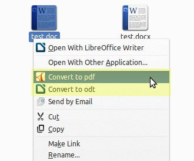
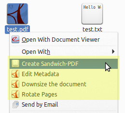
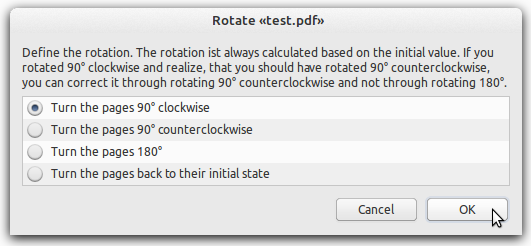
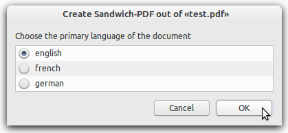
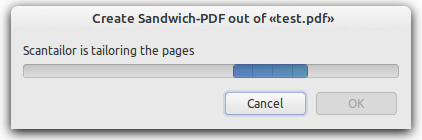
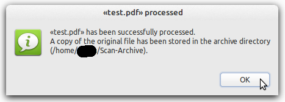
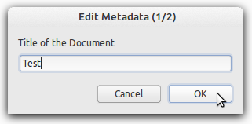
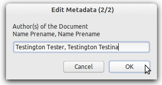

Linux Mint Nemo Actions by Alfcx
================================
## 1. Abstract ##

Nemo Actions (Linux Mint) or Nautilus Actions (Ubuntu) let you run a command, a script or a program from the context menu (the menu that shows up when you right-click on a file or folder). 
This Repository contains bilingual (english and german) Nemo Actions for Linux Mint focused on the postprocessing of scanned documents and document management. The Shell/Zenity Scripts should work on other debian based Distros too. The featured Nemo Actions are:

<b>1. PDF Document Page Rotator</b>
 Lets you rotate all the pages of a pdf document in one click ([more](#21-pdf-document-page-rotator)).
  
<b>2. Scan to Sandwich PDF</b>
 This script takes your scanned document (tif or pdf), splits double pages, corrects the alignement, sets the document to black and white, runs <b>text recognition</b>, adds a text layer to the document. You will end up with a seachable/indexable pdf document. Also stores the original file in an archive directory ([more](#22-scan-to-sandwich-pdf)).
  
<b>3. PDF Metadata Editor</b>
 Lets you edit the title- and author-tag of a pdf file ([more](#23-pdf-metadata-editor)).
  
<b>4. Pdf Document Downsizer</b>
 Reduces the size of your scanned pdf documents and stores the original file in an archive directory ([more](#24-pdf-document-downsizer)).
  
<b>5. doc(x) to odt Converter</b>
 Converts Microsoft Office documents (doc, docx) to do documents in the LibreOffice (odt) format ([more](#25-docx-to-odt-converter)).
  
<b>6. doc(x), odt, txt to pdf Converter</b>
 Converts your doc, docx, odt and txt documents to pdf files ([more](#26-docx-odt-txt-to-pdf-converter)).
 

## 2. Detailed View on the Nemo Actions in this Repository ##
### 2.1 PDF Document Page Rotator ###
#### 2.1.1 Files ####
* pdf-rotate.nemo_action
* pdf-rotate.sh
* pdf-rotate-de.sh
* pdf-rotate-en.sh

#### 2.1.2 Description ####
Lets you rotate all the the pages of a pdf file in one click (90° cw, 90° ccw, 180°). Ideal for scanned multipage documents. 

#### 2.1.3 Prerequisites ####
Pdftk is used to rotate the pages. Zenity is used to for the GUI.
<pre><code>sudo apt-get update
sudo apt-get install pdftk zenity</code></pre>

### 2.2 Scan to Sandwich PDF ###
#### 2.2.1 Files ####
* scan-to-sandwich-pdf.nemo_action
* scan-to-sandwich-pdf.sh
* scan-to-sandwich-pdf-de.sh
* scan-to-sandwich-pdf-en.sh

#### 2.2.2 Description ####
Takes your scanned documents (pdf or tif), splits double pages (if necessary), corrects page alignement, sets document to black and white, runs text recognition and adds the text layer to the pdf file. You will end up with a searchable/indexable pdf file, a so called sandwich-pdf file. 
If necessary apply the [PDF Document Page Rotator](#21-pdf-document-page-rotator) first, otherwise the text recognition will fail. 

#### 2.2.3 Prerequisites ####
This Script uses several programs. 
<pre><code>sudo apt-get update
sudo apt-get install zenity ghostscript scantailor tesseract-ocr tesseract-ocr-deu tesseract-ocr-fra exactimage pdftk</code></pre>

### 2.3 PDF Metadata Editor ###
#### 2.3.1 Files ####
* pdf-metadata-edit.nemo_action
* pdf-metadata-edit.sh
* pdf-metadata-edit-de.sh
* pdf-metadata-edit-en.sh

#### 2.3.2 Description ####
Lets you edit the <b>author</b>- and the <b>title</b>-tag of a pdf file. 

#### 2.3.3 Prerequisites ####
Pdftk is used to work the pdf file. Zenity is used to for the GUI.
<pre><code>sudo apt-get update
sudo apt-get install pdftk zenity</code></pre>

### 2.4 PDF Document Downsizer ###
#### 2.4.1 Files ####
* pdf-downsize.nemo_action
* pdf-downsize.sh
* pdf-downsize-de.sh
* pdf-downsize-en.sh

#### 2.4.2 Description ####
Reduces the size of your scanned pdf files and stores the original file in the archive directory. 
You don't need to run this script on files you edited with [Scan to Sandwich PDF](#22-scan-to-sandwich-pdf) (this script already downsizes the pdf files). 

#### 2.4.3 Prerequisites ####
Ghostscript is used to work the pdf file. Zenity is used to for the GUI. 
<pre><code>sudo apt-get update
sudo apt-get install ghostscript zenity</code></pre>

### 2.5 doc(x) to odt Converter ###
#### 2.5.1 Files ####
* convert-doc-to-odt.nemo_action

#### 2.5.2 Description ####
Converts Microsoft Office Documents (doc and docx) to Documents in the LibreOffice Format (odt).

#### 2.5.3 Prerequisites ###
Unoconv is used to convert the files.
<pre><code>sudo apt-get update
sudo apt-get install unoconv</code></pre>

### 2.6 doc(x), odt, txt to pdf Converter ###
#### 2.6.1 Files ####
* convert-to-pdf.nemo_action

#### 2.6.2 Description ####
Converts doc, docx, odt and txt files to pdf.

#### 2.6.3 Prerequisites ####
Unoconv is used to convert the files.
<pre><code>sudo apt-get update
sudo apt-get install unoconv</code></pre>

## 3. Install Nemo Actions from this Repository ##
1. Fire up a terminal; make a directory, where you can store the files from this repository; enter this directory:
<pre><code>mkdir ~/Downloads/linux-mint-nemo-actions
cd ~/Downloads/linux-mint-nemo-actions</code></pre>

2. Clone the files from this repository to your computer.
<pre><code>git clone https://github.com/Alfcx/linux-mint-nemo-actions</code></pre>

3. Make sure you have the necessary programs (for the nemo action you want) installed on your system. E.g. for the sandwich-pdf nemo action you'll have to run:
<pre><code>sudo apt-get update
sudo apt-get install zenity ghostscript scantailor tesseract-ocr tesseract-ocr-deu tesseract-ocr-fra exactimage pdftk</code></pre>

4. Copy the files for the wanted nemo action to your nemo actions directory. Linux Mint stores the Nemo Actions in <code>~/.local/share/nemo/actions</code> (user) and <code>/usr/share/nemo/actions</code> (system-wide).
Also make sure the shell scripts are executable.  E.g. for the "scan to sandwich pdf" nemo action you'll have to run:
<pre><code>cp scan-to-sandwich-pdf.nemo_action ~/.local/share/nemo/actions
cp scan-to-sandwich-pdf.sh ~/.local/share/nemo/actions
cp scan-to-sandwich-pdf-de.sh ~/.local/share/nemo/actions
cp scan-to-sandwich-pdf-en.sh ~/.local/share/nemo/actions
chmod +x ~/.local/share/nemo/actions/scan-to-sandwich-pdf.sh
chomd +x ~/.local/share/nemo/actions/scan-to-sandwich-pdf-de.sh
chmod +x ~/.local/share/nemo/actions/scan-to-sandwich-pdf-en.sh</code></pre>
5. You should now be able to see your Nemo Action in the context menu (e.g. you'll see "Create Sandwich-PDF" when you right-click on a pdf file). If you don't see the Nemo Action, log out and back in. Have Fun with this Nemo Actions and let me know if they work for you.